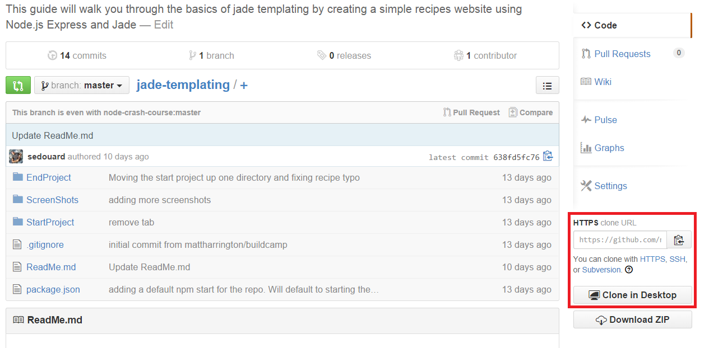

How to Use These Walkthroughs
=======================

### Waht is a Walkthrough

Its right in its name! A Walkthrough is something you use to *walk* someone *through* something interesting. Each of these repositories contains a guide that will give you what you need to do to walk other students through something fun and cool. While you're at it you'll learn a thing or two that you can use to hack or even land you a sweet gig in the tech industry!

### The README.md files

If you're reading this, you're most likely looking at this file as rendered by Github. This file is in a format called **[markdown](http://daringfireball.net/projects/markdown/)** an easy to write format which makes it easy to write simple HTML such as [links](http://google.com) right into our documents without the need of additional software like Adobe Reader or Word. We can track changes in these files easily and better collaborate to ensure they are top quality.

Each README.md represents a walk-through you could use, right out of the box to drive an event at your school. These walk-throughs contain screenshots, resources, links, code samples and detailed instructions to help you learn and give a fun and insightful session. They also contain links to resources such as **[Microsoft Virtual Academy](http://www.microsoftvirtualacademy.com/)** to help you gain deeper knowledge about the subject.

### Forking the repositories

Every repository within [mspcontent](http://github.com/mspcontent) is in itself a single walk through. To get started first you need to *fork the repository*. Ensure you install [Github for Mac](https://mac.github.com/) or [Github for Windows](https://mac.github.com/) on your machine.

From the [mspcontent](http://github.com/mspcontent) home page, pick a repository (which contains a single walk-through):


Its easy to fork the repository. First copy the **clone URL** link to your clipboard.



On a Mac, just use spotlight search to open up '**Terminal**':


On Windows, just search for **Git Shell**.


In the shell, execute the command:

```bash
# Replace '<INSERT CLONE URL HERE>' the the actual clone link from the repository page from the previous step
git clone <INSERT CLONE URL HERE>
# Replace '<REPOSITORY NAME>' with the name of the repository you are cloning.
cd <REPOSITORY NAME>
# On a Mac do this command
open .
# On a PC do this comand
start .
```

So for example, if we want to clone the repository **[jade-templating](http://github.com/jade-templating)** we would execute the commands:

```bash
git clone https://github.com/mspcontent/jade-templating.git
cd jade-templating
# On a Mac do this command
open .
# On a PC do this comand
start .
```

This will leave you with the folder open under your file explorer:


Or Finder:


Follow the instructions in the README.md file within the repository and get hacking!

# Resources

[How to use the git command line](http://rogerdudler.github.io/git-guide/)

[How to use the github graphical git client](https://windows.github.com/help.html)
